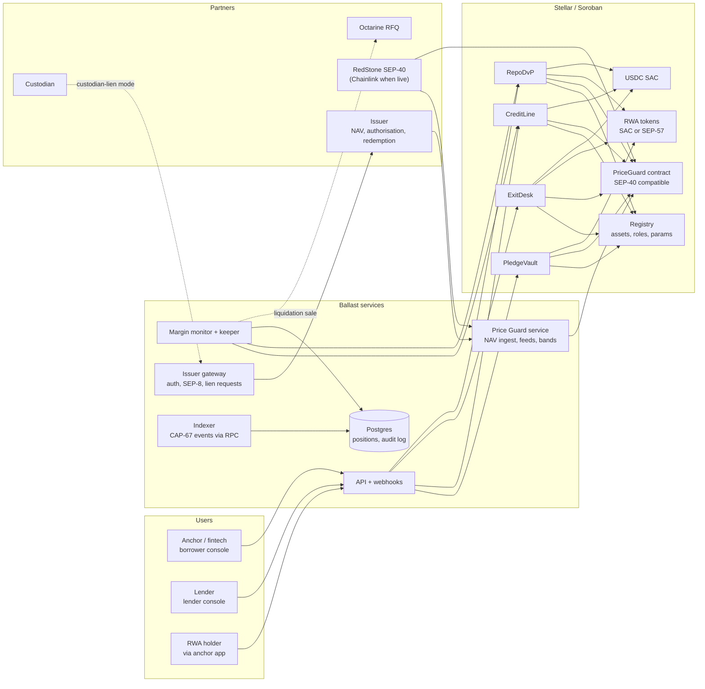

# PRD — Ballast

**What it is:** a collateral and liquidity network that lets Stellar anchors and fintechs use
tokenized Treasuries as working capital.
**Combines:** idea 1 (collateral rail), idea 3 (instant exit), idea 2 (intraday repo), idea 5
(LATAM treasury, as the go-to-market).
**Version:** 1.0 · 2026-09-16
**Status:** Draft for build. Phase 0 (discovery) gates every later phase.
**Evidence labels:**
- **VERIFIED:** confirmed by the three deep-research runs of 2026-09-16 or the diligence of
  2026-09-09, with sources in §18.
- **REASONED:** follows from verified facts, not checked directly.
- **ASSUMPTION:** a guess to test in Phase 0.

---

## 1. Summary

Stellar holds about $4B of tokenized real-world assets, and almost none of it does any work.
Anchors and payment fintechs, meanwhile, lock cash that earns nothing in prefunding accounts at
every corridor endpoint.

Ballast connects the two. An anchor pledges tokenized T-bills or money-market fund shares it
already holds and draws USDC against them. Later, the same engine lets a holder swap an RWA token
for USDC instantly, and lets two parties do a same-day repo.

Ballast writes the contracts, prices the collateral and watches the positions. In the first
phase, a regulated lender partner supplies the USDC, so Ballast does not need a balance sheet to
launch.

It ships in three products on one engine, sold first to Latin American fintechs:

1. the **collateral rail**
2. **instant exit**
3. **intraday repo**

---

## 2. Problem and evidence

### 2.1 Pain statements

> **An anchor or payment fintech** keeps idle cash in prefunding accounts so payouts can settle
> instantly. That cash earns nothing. Its treasury may already hold tokenized T-bills on Stellar,
> but no lender on Stellar accepts them as collateral for a prefunding or FX line. REASONED from
> the prefunding model (VERIFIED in the 2026-09-09 corridor diligence) and the absence of such a
> product (below).

> **A holder of a tokenized money-market fund on Stellar** who needs to pay someone must redeem
> through the issuer on the issuer's schedule, then move the cash. The fund token cannot fund a
> payment directly. REASONED.

> **A lender with idle USDC** has no safe, rule-respecting way on Stellar to lend against
> Treasuries for hours or days. REASONED.

### 2.2 The numbers

| Fact | Value | Status |
|---|---|---|
| RWA value on Stellar | $3.996B on 2026-08-29, up from $868.8M at end-2025 | VERIFIED |
| Largest issuers | Spiko ~$1.55B (39%), Realiz $559M, Tradable $548M, Franklin Templeton $546M, Ondo $535M | VERIFIED |
| Non-US government debt on Stellar | ~$490M; Stellar leads Ethereum in this category (2026-08-20) | VERIFIED |
| RWA used in Blend lending pools | ~$2M, against $127M total Blend TVL | VERIFIED (source is RedStone, which sells oracles) |
| RWA used in Templar vaults | ~$8.4M, against deJAAA, deJTRSY, CETES and USTRY | VERIFIED |
| Total Stellar DeFi TVL | $213M–$259M (sources disagree) | VERIFIED |
| Broadridge tokenized repo (not on Stellar) | $351B per day average, August 2026 | VERIFIED |
| Tokenized MMF as exchange collateral | Binance × Franklin Templeton: BENJI shares stay with Ceffu custody and count as margin; live since Feb 2026 | VERIFIED |

About 99.7% of Stellar's RWA value is outside DeFi. The same assets already serve as collateral
at large scale elsewhere.

### 2.3 Why now

| Clock | Date | Status |
|---|---|---|
| Figure YLDS (SEC-registered yield-bearing dollar) live on Stellar, aimed at LATAM fintechs | 2026-05-05 | VERIFIED |
| Anchorage Digital custodies Etherfuse tokenized CETES on Stellar | 2026-06-15 | VERIFIED |
| RedStone SEP-40 feeds for USDY, deJTRSY, deJAAA and Etherfuse debt | 2026-07/08 | VERIFIED |
| OpenZeppelin RWA Wizard makes SEP-57 / T-REX issuance no-code (testnet) | 2026-08-27 | VERIFIED |
| Stellar RWA value quadrupled in eight months | 2026-08-29 | VERIFIED |
| DTCC plans to connect its tokenization service to Stellar | H1 2027 | VERIFIED |

The assets, custody and price feeds arrived in 2026. Nobody has built the layer that puts them
to work.

### 2.4 What exists, and why it is not this

| Project | What it does | Gap |
|---|---|---|
| **Blend v2** | Isolated lending pools. Each pool admin sets collateral factors; changes wait 7 days | Built for liquid crypto. Collateral value ignores liquidity. The YieldBlox pool lost ~61.3M XLM + 1.01M USDC to a manipulated RWA price. RWA use ~$2M. VERIFIED |
| **Templar** | Lending vaults on six Stellar RWAs (deJAAA, deJTRSY, CETES, USTRY and others), opened 2026-04-01 | Retail/DeFi lending. No anchor credit lines, no issuer-in-the-loop controls, no repo. ~$8.4M. VERIFIED (scope REASONED) |
| **Octarine** (SCF #44, $129,700) | Quote-request (RFQ) secondary liquidity for Stellar RWAs, whitelisted and KYC'd parties | A trading venue. Not credit, not payment exits. **Partner** candidate: a liquidation and exit venue for Ballast. VERIFIED |
| **Huma** | Senior/junior tranche vault for Soroban | Testnet only. Receivables credit, not RWA collateral. VERIFIED |
| **Binance × Ceffu** | Tokenized MMF as off-exchange margin | Exchange margin only. Not on Stellar, not for anchors. VERIFIED |
| **Broadridge DLR, JPMorgan Kinexys** | Institutional tokenized repo | Permissioned bank ledgers. Not on Stellar. VERIFIED (DLR); Kinexys REASONED |
| **Issuer redemption desks** (Spiko, Franklin, Ondo, Etherfuse) | Primary redemption | Run on the issuer's schedule. No credit, no instant exit on Stellar found. REASONED (absence of evidence) |
| **Custodians** (Anchorage, Fireblocks, Copper) | Custody; Anchorage holds CETES tokens | No Stellar collateral programme found. **Partner** candidates. REASONED (absence of evidence) |

The absence of an equivalent product on Stellar was not found by any search. It is not proven.
Phase 0 must confirm it.

---

## 3. Goals and non-goals

### Goals

1. Let an anchor draw USDC against tokenized Treasuries it holds, within one business day of
   onboarding, without the assets leaving issuer-approved accounts.
2. Never lend or liquidate on a single price source. Price RWAs so that the YieldBlox failure
   cannot happen here.
3. Respect every issuer control: authorisation, freeze, clawback, SEP-8 approval and SEP-57
   identity checks. A regulated issuer should be comfortable naming Ballast as an approved holder.
4. Put **$25M of RWA value to work within 12 months of Phase 1 launch** (ASSUMPTION target; see
   §13).
5. Stay out of balance-sheet lending until the product is proven. Capital comes from partners in
   Phase 1.

### Non-goals

- **Issuing tokens.** The OpenZeppelin RWA Wizard covers this.
- **A retail lending market.** Blend and Templar serve retail. Ballast serves businesses.
- **A public AMM or exchange.** Octarine and the classic DEX exist. Ballast routes to them.
- **Cross-chain bridging.** Out of scope for this repo.
- **Reconciliation software for transfer agents.** Out of scope for this repo.
- **Reusable KYC.** This idea was killed on 2026-09-09. Ballast uses partner and issuer KYC.
- **Uncollateralised credit.** Every USDC out is backed by pledged assets.

---

## 4. Users and jobs to be done

| User | Job | Product |
|---|---|---|
| **Anchor / payment fintech treasurer** | "Earn yield on prefunding without losing the ability to pay out instantly." | Collateral rail |
| **Anchor operations lead** | "When a big payout arrives and prefunding is short, get USDC in minutes, not days." | Collateral rail (draw), instant exit |
| **Fintech end user holding YLDS, CETES or USDY** | "Pay someone now from my savings token." | Instant exit, through the anchor |
| **Institutional lender / credit fund** | "Lend USDC against Treasuries with automatic margining and a clear default path." | Collateral rail (lender side), repo |
| **Market maker** | "Borrow USDC overnight against my Treasury inventory." | Repo |
| **RWA issuer** (Spiko, Etherfuse, Franklin, Ondo, Figure) | "More uses for my token, without losing control of who holds it." | All; the issuer is a partner, not a customer |
| **Custodian** (Anchorage-class) | "Offer collateral services on assets I already hold." | Custodian-lien mode (§6.3) |

---

## 5. Product scope by phase

### Phase 0 — Discovery and kill criteria (weeks 0–6)

**The one question:** why is ~$4B of Stellar RWA supply not used in DeFi? Each answer leads
somewhere different:

| Answer | Consequence |
|---|---|
| Issuers restrict transfers and whitelists | Ballast must be issuer-in-the-loop. Issuer-lien mode (§6.3) becomes the default. |
| Missing oracles and risk settings after the USTRY exploit | The Price Guard (§6.4) is the core product. |
| Holders do not want to borrow | **Stop.** This repo's core assumption doesn't hold. |

**Work:**

1. **Interviews.** 3–5 anchors and fintechs (§14 targets), 2 issuers (Spiko, Etherfuse first),
   1 lender, 1 custodian.
2. **Legal memo** covering four questions (counsel, one jurisdiction first):
   - pledge versus title-transfer for tokenized fund shares
   - whether Ballast is a lender or arranger
   - licensing for the lender partner
   - whether issuers can authorise a contract address as a holder
3. **Technical checks** (the §18 "verify" items):
   - How the SAC treats contract balances of `AUTH_REQUIRED` assets.
   - Whether issuers require SEP-8 approval for transfers into a contract.
   - How each target asset pays yield: rising NAV, or distributed shares.
4. **Competitor confirmation:** no live Stellar product for pledged-RWA credit, instant exit or
   repo.

**Exit criteria (all required):**

- 1 anchor signs a letter of intent to pledge at least $500K.
- 1 issuer agrees to authorise Ballast's vault or to run issuer-lien mode.
- 1 lender agrees to fund at least $2M of credit lines.
- The legal memo finds a structure that does not make Ballast a licensed lender in Phase 1.

**Kill criteria:** any exit criterion fails after 10 weeks, or a custodian, issuer or Blend pool
ships anchor collateral lines on Stellar first.

---

### Phase 1 — Collateral rail (months 1–4)

**Scope:** one anchor, one asset, one lender, one custody mode. Testnet by month 2; capped mainnet
by month 4.

| Feature | Detail |
|---|---|
| Asset onboarding | Registry entry per asset: issuer, SAC or SEP-57 contract, yield type, redemption terms, haircut inputs, price sources, custody mode |
| Pledge | Borrower pledges RWA tokens into a Pledge Vault position (escrow mode) or has them locked in place (issuer-lien mode) |
| Credit line | Lender commits a USDC limit to a borrower. Borrower draws and repays up to `collateral value × (1 − haircut)` |
| Interest | Fixed annual rate per line, accrued per ledger. Interest goes to the lender; Ballast's platform fee is taken on top |
| Yield pass-through | Distributed yield (new shares) credited to the borrower's position. Accumulating NAV just raises collateral value |
| Margin | LTV bands: **healthy / warning / margin call / liquidation**. Webhooks and email at each change |
| Top-up and cure | Borrower adds collateral or repays within a cure window (default 24h for MMFs; per asset) |
| Liquidation | After the cure window: issuer redemption to the lender, or transfer of collateral to the lender, or sale via Octarine RFQ. Never an AMM swap |
| Price Guard v1 | Median of issuer NAV and at least one independent feed (RedStone SEP-40). Deviation band and staleness checks (§6.4) |
| Consoles | Borrower: positions, headroom, draw/repay. Lender: exposure, margin status, defaults |
| Pause | A single pauser role can freeze new draws immediately. Liquidations and repayments continue |

**Phase 1 assets, in priority order** (Phase 0 decides):

1. **An EU/US T-bill MMF with a price feed.** Spiko is the largest on Stellar (~$1.55B). Franklin
   BENJI uses native Stellar controls.
2. **USDY.** The RedStone SEP-40 feed is live.
3. **CETES.** Anchorage custody, RedStone feed, and the LATAM wedge. It needs an MXN/USD FX
   haircut.

**Done when:**

- A mainnet anchor has drawn and repaid USDC against pledged RWA at least 10 times.
- One margin call has been cured end to end in a drill.
- A liquidation drill has recovered 100% of principal on testnet, through issuer redemption.

---

### Phase 2 — Instant exit (months 4–7)

**Scope:** RWA token → USDC in one transaction, for holders of Phase 1 assets.

| Feature | Detail |
|---|---|
| Exit quote | Price = Price Guard value × (1 − exit spread). The spread covers funding cost for the issuer redemption lag plus a risk buffer |
| Funding | USDC comes from a Ballast Exit Facility: a credit line from the Phase 1 lender, secured by the RWA tokens the desk takes in |
| Settlement | Atomic Soroban swap. The holder's RWA goes to the desk; USDC goes to the holder (or straight to an anchor payout, below) |
| Anchor payout hop | Contract accounts cannot pay anchors or exchanges that need a memo from a G-address (VERIFIED 2026-09-09). Payouts to anchors go through an operator G-account hop with the memo |
| Desk rebalancing | The desk redeems accumulated RWA with the issuer on its schedule and repays the facility |
| Limits | Per-holder and per-day caps; total desk inventory cap tied to facility size |
| Eligibility | Holder must already be authorised for the asset. Exit never lets an unapproved party receive or hold RWA |

**Done when:** at least $1M of cumulative exits, a median quote-to-settlement time under 10
seconds, and zero exits priced outside the Price Guard band.

---

### Phase 3 — Intraday and term repo (months 7–11)

**Scope:** two-party repo of RWA tokens against USDC, with atomic delivery-versus-payment (DvP)
on both legs.

| Feature | Detail |
|---|---|
| Trade types | Intraday (same-day unwind), overnight, open (callable), term (up to 30 days) |
| Leg 1 | Atomic: RWA from seller to buyer, USDC from buyer to seller. Both legs settle in one transaction or neither does |
| Leg 2 | Scheduled unwind: USDC plus repo interest back, RWA back. Either party can trigger it at maturity; a keeper triggers it if both are absent |
| Margin | Same bands as Phase 1. Variation margin in USDC or extra RWA |
| Fail path | If the cash borrower fails leg 2, the cash lender keeps the RWA (title transfer) and the remaining margin is settled |
| Legal wrapper | A GMRA-style master agreement signed off-chain; the contract references its hash |
| Matching | Phase 3 matches bilaterally through RFQ in the lender console. A multi-party book is out of scope |
| Yield during repo | Manufactured payment: yield paid on the RWA during the term is passed back to the original owner |

**Done when:**

- At least 3 counterparties are live.
- At least $10M of cumulative notional has been traded.
- There have been no failed leg-2 unwinds without a margin cure.

---

### Phase 4 — LATAM treasury bundle (from month 4, in parallel)

**Scope:** package the three products for Brazilian, Mexican and Argentine fintechs. This is a
go-to-market track, not a separate engine.

| Feature | Detail |
|---|---|
| Asset set | CETES, TESOURO (Etherfuse), YLDS (Figure), plus the Phase 1 USD MMF |
| FX-aware haircuts | Local-currency collateral against USDC credit adds an FX volatility haircut and a currency-mismatch cap |
| Treasury view | One dashboard: yield earned, credit headroom, exit capacity |
| Local payouts | Instant exit into local stablecoins through anchors, where they exist (ASSUMPTION: availability per market to be checked) |
| Onboarding kit | Checklist for the fintech's regulator: what it holds, where it is custodied, how it is valued |

**Done when:** 3 LATAM fintechs have live treasury bundles and at least $5M of pledged local
sovereign debt.

---

## 6. Architecture

### 6.1 System diagram



### 6.2 Contracts (Soroban, Rust)

| Contract | Responsibility | Holds funds? |
|---|---|---|
| `Registry` | Asset configs, haircut parameters, role addresses (admin, pauser, keeper, price publisher), timelocked changes | No |
| `PriceGuard` | Stores issuer-signed NAV, reads independent SEP-40 feeds, exposes a guarded `price()` that returns a value **plus a status** (`Ok`, `Degraded`, `Halted`). Also exposes the SEP-40 interface so other protocols can use it | No |
| `PledgeVault` | One position per (borrower, asset). Escrow mode holds RWA; issuer-lien mode records a lien on tokens held elsewhere | Escrow mode: RWA |
| `CreditLine` | Lender commitments, draws, repayments, interest accrual, LTV computation, margin state machine, liquidation entry point | USDC in transit only |
| `ExitDesk` | Quotes and settles RWA → USDC swaps within caps, drawing on the exit facility | RWA inventory, USDC float |
| `RepoDvP` | Repo trades: atomic leg 1, scheduled leg 2, margin, fail handling | RWA and USDC during term |

All contracts follow the same conventions:

- `require_auth` on every user action
- single-purpose admin functions
- a 48-hour timelock on parameter changes
- a pauser that skips the timelock but can only **stop** things, never move funds

### 6.3 Custody modes

The research showed regulated issuers on Stellar prefer native asset controls (BENJI uses
authorisation and clawback, with no custom contract; VERIFIED). Ballast supports three modes so
it can work with however an issuer operates.

| Mode | How collateral is held | How default works | Needs | Best for |
|---|---|---|---|---|
| **A. Escrow** | RWA moves into `PledgeVault` (a contract address) | Vault transfers to the lender or redeems | Issuer authorises the vault contract as a holder (SAC `set_authorized` or SEP-57 `verify_identity` registration) | Assets whose issuer can authorise a contract |
| **B. Issuer-lien** | RWA stays in the borrower's account. The issuer downgrades the trustline to `AUTHORIZED_TO_MAINTAIN_LIABILITIES` (can hold, cannot send) | Issuer claws back to the lender or redeems on Ballast's signed instruction | Issuer API or signer integration per pledge and release | Issuers that won't authorise contracts but will act on instructions |
| **C. Custodian-lien** | RWA sits with a qualified custodian (Anchorage-class) under a tri-party agreement. Ballast records the lien on-chain | Custodian delivers to the lender on Ballast's instruction | Tri-party legal agreement; custodian API | Institutions whose policy requires a qualified custodian; mirrors Binance/Ceffu |

**Default:** mode A where the issuer allows it, because it is the only mode with on-chain
enforcement. Mode B is the Phase 0 fallback. Mode C is Phase 2+ and led by a partner.

**SEP-57 note (VERIFIED):** under the OpenZeppelin RWA suite, every transfer checks
`verify_identity` on sender and receiver and runs `can_transfer` on the compliance contract.
There is no exemption for contracts, so `PledgeVault`, `ExitDesk` and `RepoDvP` each need a
registered identity with valid claims from the issuer's trusted claim issuers.

Uniswap v4's permissioned pools show a cleaner route: one adapter contract is registered once and
the other contracts keep internal balances. Ballast will use a single `Custody` contract behind
all three to keep issuer onboarding to one identity per asset. REASONED.

### 6.4 Price Guard

Why this is the core: the 2026-02-22 YieldBlox exploit used a manipulated Reflector DEX price for
USTRY to borrow about 61.3M XLM and 1.01M USDC from a Blend pool (VERIFIED). A thinly traded RWA
has a DEX price anyone can move. Ballast never lends against it or liquidates on it.

**Inputs, per asset:**

| Source | Role | Weight in median |
|---|---|---|
| Issuer NAV, signed by the issuer's key or published on a verified endpoint | Primary | 1 |
| Independent SEP-40 feed (RedStone today; Chainlink Data Feeds when live on Stellar) | Check | 1 |
| Last redemption price observed from issuer redemptions (indexer) | Check | 1 |
| DEX or RFQ price (classic DEX, Octarine) | **Monitoring only**, never used in the value | 0 |

**Rules:**

| Rule | Action |
|---|---|
| Fewer than 2 fresh sources | `Degraded`: no new draws, exits or repos. Existing positions keep the last good price |
| Any two sources differ by more than the asset's band (default 50 bps for USD MMFs, 150 bps for EM sovereign debt; ASSUMPTION) | `Degraded`, and an alert |
| Price moves more than the daily band against its own last value (default 1% for MMFs) | `Halted`: no liquidations until a human confirms. Draws paused |
| NAV older than its schedule plus grace (e.g. daily NAV + 6h) | Source counted as stale |
| Liquidation | Only allowed at `Ok` status **and** if a second price read, at least 1 ledger later, still confirms the breach |

The status is part of every price read, so contracts cannot accidentally use a degraded price.

**Collateral value:**

```
collateral_value = units × guarded_price × (1 − haircut)
haircut          = base(asset_class)
                 + liquidity_addon(redemption_lag_days, daily_redemption_cap_use)
                 + fx_addon(collateral_ccy ≠ loan_ccy)
                 + concentration_addon(position_share_of_asset_supply)
```

**Starting haircuts** (ASSUMPTION; set with the lender partner in Phase 0):

| Asset class | Base | Typical total |
|---|---|---|
| USD government MMF, daily liquidity | 2% | 3–5% |
| Short-dated US Treasury token | 3% | 4–7% |
| EUR government MMF against USD loan | 2% + FX | 8–12% |
| EM sovereign bills (CETES, TESOURO) against USD loan | 5% + FX | 20–30% |

The **liquidity add-on is where the research's gap on liquidity-aware collateral lives**. No
lending protocol anywhere was found to adjust collateral for real liquidity (VERIFIED absence
across Blend and Morpho). Ballast computes it off-chain from indexer data:

- redemption queue
- turnover
- holder concentration

It publishes the add-on to `Registry` through the timelock. Emergency increases skip the
timelock; decreases never do.

### 6.5 Off-chain services (TypeScript)

| Service | Job |
|---|---|
| `api` | REST and webhooks for consoles and integrators; SEP-10 auth for Stellar accounts, plus API keys for institutions |
| `price-guard` | Pulls issuer NAV and feeds, signs and pushes updates to `PriceGuard` |
| `indexer` | CAP-67 events and contract events over Stellar RPC; S3 data lake for backfill (RPC keeps about 7 days; VERIFIED) |
| `margin-monitor` | Recomputes LTV on every price update and position event; drives the margin state machine; calls liquidation |
| `keeper` | Submits scheduled transactions: repo leg 2, interest accrual checkpoints, cure-window expiries |
| `issuer-gateway` | Requests authorisation, SEP-8 approvals, lien freeze and release, redemptions; one adapter per issuer |
| `payout-hop` | Operator G-account that forwards USDC to anchors with the required memo |
| `ledger` | Postgres double-entry books mirroring on-chain state; nightly on-chain vs. database reconciliation |

### 6.6 Key technical decisions

| Decision | Choice | Why |
|---|---|---|
| Chain | Stellar mainnet, Soroban contracts | The assets and anchors are here |
| Contract language | Rust, `soroban-sdk`, OpenZeppelin Stellar contracts where they apply | OZ identity and access modules are audited building blocks |
| Services | TypeScript, pnpm + Turborepo monorepo | Shared packages (`network-config`, `observability`) keep services consistent |
| Database | Postgres (not Convex) | A credit product needs double-entry books, point-in-time queries and auditor access |
| Price | Median of independent sources with status | The YieldBlox lesson |
| Liquidation | Issuer redemption or transfer in kind first; RFQ sale second; AMM never | Thin RWA markets cannot absorb forced sales |
| Custody | Mode A default, one shared `Custody` contract identity | Fewest issuer approvals, on-chain enforcement |
| Upgrades | Upgradeable contracts behind a 48h timelock and multisig admin in Phases 1–2; freeze core logic after audit | Credit logic will change early; users need notice |
| Capital | Partner-funded in Phase 1; Ballast facility in Phase 2; SEP-56 LP vault only in Phase 4+ and only if counsel clears it | Pool shares are probably securities (REASONED) |

---

## 7. Data model (Postgres)

```sql
-- Assets and parameters
asset (
  id uuid pk, code text, issuer_g text, contract_c text,
  standard text check (standard in ('classic_sac','sep57')),
  yield_type text check (yield_type in ('accumulating','distributing')),
  custody_mode text check (custody_mode in ('escrow','issuer_lien','custodian_lien')),
  ccy text, redemption_lag_days int, redemption_daily_cap numeric,
  nav_schedule text, price_band_bps int, daily_move_band_bps int,
  haircut_base_bps int, haircut_fx_bps int, status text, created_at timestamptz
)
asset_param_change (id, asset_id fk, field, old, new, queued_at, executes_at, tx_hash, executed_at)

-- Parties
party (id uuid pk, kind text check (kind in ('borrower','lender','holder','issuer','custodian','keeper')),
       legal_name, jurisdiction, kyb_status, kyb_provider, kyb_ref, created_at)
party_account (party_id fk, stellar_account text, role text, verified_at)

-- Credit
credit_line (id uuid pk, lender_id fk, borrower_id fk, loan_ccy text, limit numeric,
             rate_bps int, fee_bps int, cure_window_s int, status text, contract_line_id text,
             agreement_hash text, opened_at, closed_at)
pledge (id uuid pk, credit_line_id fk, asset_id fk, units numeric, custody_mode text,
        contract_position_id text, lien_ref text, status text, created_at)
draw (id, credit_line_id fk, amount, tx_hash, ledger, created_at)
repayment (id, credit_line_id fk, principal, interest, tx_hash, ledger, created_at)
margin_event (id, credit_line_id fk, from_state, to_state, ltv_bps, price_snapshot_id fk, created_at)
liquidation (id, credit_line_id fk, route text check (route in ('redeem','transfer','rfq')),
             units, proceeds, shortfall, tx_hashes text[], started_at, completed_at)

-- Price
price_observation (id, asset_id fk, source text, value numeric, observed_at, signature, stale bool)
price_snapshot (id, asset_id fk, guarded_value numeric, status text, sources jsonb, ledger, created_at)

-- Exit
exit_quote (id, holder_id fk, asset_id fk, units, price, spread_bps, usdc_out, expires_at, status)
exit_fill (id, quote_id fk, tx_hash, payout_route text, payout_memo text, created_at)

-- Repo
repo_trade (id uuid pk, cash_lender_id fk, cash_borrower_id fk, asset_id fk, units, cash_amount,
            rate_bps, kind text check (kind in ('intraday','overnight','open','term')),
            start_ledger, maturity_at, agreement_hash, status, leg1_tx, leg2_tx)
repo_margin_call (id, trade_id fk, amount, ccy, due_at, cured_at)

-- Books and audit
journal_entry (id, ref_type, ref_id, account, debit, credit, ccy, created_at)
audit_log (id, actor, action, payload jsonb, tx_hash, created_at)
chain_event (id, ledger, tx_hash, contract, topic, data jsonb, ingested_at)
reconciliation_run (id, scope, started_at, breaks int, report jsonb)
```

Every row that reflects on-chain state stores the `tx_hash` and ledger that produced it. The
nightly `reconciliation_run` compares Postgres books against contract state and CAP-67 events.
Any break pages the on-call engineer.

---

## 8. Contract interfaces (v1 sketch)

```rust
// Registry
fn asset(e: Env, asset: Address) -> AssetConfig;
fn queue_param(e: Env, admin: Address, asset: Address, change: ParamChange) -> u64; // 48h
fn execute_param(e: Env, id: u64);
fn raise_haircut_now(e: Env, risk: Address, asset: Address, add_bps: u32); // increase only, no timelock
fn pause(e: Env, pauser: Address, scope: PauseScope);   // stops new draws/exits/repos only
fn unpause(e: Env, admin: Address, scope: PauseScope);  // timelocked

// PriceGuard  (also implements SEP-40 lastprice/price for external readers)
fn publish_nav(e: Env, publisher: Address, asset: Address, value: i128, ts: u64, sig: BytesN<64>);
fn guarded_price(e: Env, asset: Address) -> GuardedPrice; // { value, status: Ok|Degraded|Halted, ts, sources }
fn confirm_halt_cleared(e: Env, risk: Address, asset: Address);

// PledgeVault
fn pledge(e: Env, borrower: Address, line: u64, asset: Address, units: i128);
fn release(e: Env, borrower: Address, line: u64, asset: Address, units: i128); // only if LTV stays healthy
fn record_lien(e: Env, gateway: Address, line: u64, asset: Address, units: i128, lien_ref: Bytes); // modes B/C

// CreditLine
fn open(e: Env, lender: Address, borrower: Address, limit: i128, rate_bps: u32, cure_s: u64, agreement: BytesN<32>) -> u64;
fn fund(e: Env, lender: Address, line: u64, amount: i128);
fn draw(e: Env, borrower: Address, line: u64, amount: i128, to: Address);
fn repay(e: Env, payer: Address, line: u64, amount: i128);
fn ltv(e: Env, line: u64) -> LtvView;           // { debt, collateral_value, ltv_bps, state, price_status }
fn poke(e: Env, line: u64) -> MarginState;      // anyone; moves the state machine
fn liquidate(e: Env, keeper: Address, line: u64, route: LiquidationRoute);

// ExitDesk
fn quote(e: Env, asset: Address, units: i128) -> ExitQuote;
fn exit(e: Env, holder: Address, asset: Address, units: i128, min_usdc: i128, to: Address) -> i128;

// RepoDvP
fn propose(e: Env, cash_lender: Address, terms: RepoTerms) -> u64;
fn accept_and_settle(e: Env, cash_borrower: Address, id: u64); // atomic leg 1
fn unwind(e: Env, caller: Address, id: u64);                     // leg 2
fn call_margin(e: Env, keeper: Address, id: u64);
fn default_close(e: Env, keeper: Address, id: u64);
```

### Invariants (property tests and audit targets)

1. **Never over-lent.** `draw` fails if post-draw LTV exceeds the healthy threshold using the
   `guarded_price` at status `Ok`.
2. **No draws on a bad price.** No draw, exit or new repo proceeds unless price status is `Ok`.
3. **No quick liquidation.** No liquidation without an `Ok` price confirmed on two reads at least
   1 ledger apart, and an expired cure window.
4. **Collateral is released in only two ways:** `release` with healthy post-release LTV, or
   `liquidate`. Nothing else can move RWA out of `PledgeVault`.
5. **Pausing cannot move funds.** `pause` blocks new risk only. Repayment, cure and liquidation
   always work while paused.
6. **The admin cannot move user funds.** No admin function can send pledged RWA or lender USDC
   to an arbitrary address.
7. **Repo legs are atomic.** Leg 1 settles both assets or neither.
8. **Issuer controls stay intact.** Every RWA transfer out of a Ballast contract goes to an address
   the issuer has authorised. If the target is not authorised, the transfer reverts; it is never
   routed somewhere else.
9. **Books match the chain.** Sum of positions in Postgres equals contract balances per asset at
   each reconciliation. A mismatch is a P1 incident.

---

## 9. API (v1)

```
Auth: SEP-10 JWT for Stellar accounts; API key + HMAC for institutions.

GET    /v1/assets                         supported assets, haircuts, price status
GET    /v1/assets/{id}/price              guarded price, sources, status, history

POST   /v1/credit-lines                   lender opens a line for a borrower
GET    /v1/credit-lines/{id}              limit, drawn, LTV, state, next accrual
POST   /v1/credit-lines/{id}/pledges      returns an unsigned XDR for the borrower to sign
POST   /v1/credit-lines/{id}/draws        returns unsigned XDR; optional payout to an anchor with memo
POST   /v1/credit-lines/{id}/repayments   returns unsigned XDR
DELETE /v1/credit-lines/{id}/pledges/{p}  release; returns unsigned XDR if LTV permits

POST   /v1/exit/quotes                    { asset, units } → { price, spread_bps, usdc_out, expires_at }
POST   /v1/exit/quotes/{id}/execute       returns unsigned XDR; or server-side payout hop to an anchor

POST   /v1/repo/proposals                 terms → proposal id
POST   /v1/repo/proposals/{id}/accept     returns unsigned XDR for atomic leg 1
POST   /v1/repo/trades/{id}/unwind        returns unsigned XDR for leg 2

GET    /v1/positions?party=               everything a party has open
GET    /v1/reports/daily?date=            positions, marks, margin events, P&L (CSV/JSON)

Webhooks (HMAC-signed, retried with backoff):
  price.status_changed · margin.state_changed · margin.call_issued · margin.cured
  liquidation.started · liquidation.completed · exit.filled · repo.leg1_settled
  repo.unwind_due · repo.defaulted
```

Ballast never holds customer signing keys. Every state change the customer initiates returns
unsigned XDR for them to sign. The only exceptions are the keeper and the payout hop, which are
operator keys held in KMS.

---

## 10. Legal, regulatory and custody position

All ASSUMPTION until the Phase 0 legal memo.

| Phase | Ballast's role | What that should avoid | Who carries the licence |
|---|---|---|---|
| 1 | Technology provider and collateral agent. Writes contracts, prices, monitors, instructs on default | Ballast is not the lender and does not hold USDC | The lender partner |
| 2 | Operator of an exit facility funded by a lender | Buying RWA tokens at a discount may count as dealing in securities | Counsel; possibly done through a licensed partner's entity |
| 3 | Venue or arranger for bilateral repo | Could count as operating a trading venue or ATS | Counsel; bilateral RFQ only, no multi-party order book |
| 4+ | LP vault manager | Pool shares are probably securities | Only with a registered or exempt structure |

**Non-negotiables:**

- **KYB for every party.** Through the lender partner's programme or an established provider. No
  new KYC product (the killed idea).
- **Sanctions screening** on every account before any authorisation request to an issuer.
- **Travel Rule data** for USDC transfers above thresholds, in the corridor partner's format.
- **Master agreements** (credit agreement, pledge agreement, GMRA-style repo) signed off-chain,
  with their hash stored on-chain.
- **Issuer eligibility rules override Ballast rules.** If an issuer's register says a party is not
  eligible, Ballast refuses to act, even mid-liquidation. The collateral then goes to the lender
  through issuer redemption.

---

## 11. Security

| Area | Control |
|---|---|
| Audits | Two independent audits before mainnet: contracts, and Price Guard economics. Re-audit on any change to `CreditLine`, `PledgeVault` or `RepoDvP` |
| Admin | 3-of-5 multisig; 48h timelock on parameters and upgrades; separate pauser key |
| Operator keys | Keeper, price publisher and payout hop in KMS; each with the narrowest role; balances capped and monitored |
| Price | §6.4 guard. Publisher key compromise is limited because one source cannot move the median outside the band |
| Mainnet caps | Phase 1: $1M total credit, $250K per borrower. Raised only after 30 days without incident, through the timelock |
| Testing | Unit and property tests for every invariant in §8; fork tests against mainnet state; Price Guard fuzzing with adversarial price paths, including a replay of the USTRY manipulation |
| Drills | Monthly: margin call → cure; liquidation via redemption; price source outage; pauser use; key rotation |
| Bug bounty | From mainnet launch; scope: contracts and Price Guard |
| Monitoring | Alerts: price `Degraded`/`Halted`, any line in margin call, keeper balance low, reconciliation break, RPC lag > 60s |

---

## 12. Pricing and unit economics

| Product | Payer | Model | Starting point (ASSUMPTION) |
|---|---|---|---|
| Collateral rail | Borrower, through the rate | Platform fee on drawn balance | 50–100 bps a year on drawn USDC |
| Collateral rail | Lender | Collateral-agent fee | 10–25 bps a year on committed limit |
| Instant exit | Holder | Exit spread | 10–40 bps for USD MMFs; more for EM debt |
| Repo | Cash borrower | Fee on notional | 2–5 bps per trade + 5–10% of the repo interest |
| Price Guard | Other protocols (Blend pools, Templar) | Data licence for the SEP-40 guarded feed | $1–3K a month per protocol |

### Illustrative anchor

**Assumptions:** a 4% T-bill yield and a 7% credit line rate. Both are to be confirmed; neither is
a verified market figure.

- **Today:** the anchor keeps $5M of prefunding in cash, earning 0%.
- **With Ballast:** it holds $5M in a tokenized T-bill MMF earning $200K a year. It keeps a $4.75M
  credit line (5% haircut) and draws on average $1M for an average of 60 days a year.
  - Interest cost: $1M × 7% × 60/365 ≈ $11.5K.
  - Ballast fee on that drawn balance at 75 bps: ≈ $1.2K.
- **Net benefit to the anchor:** ≈ $187K a year.
- **Ballast revenue from this anchor:** ≈ $1.2K (borrower) + $4.75M × 15 bps ≈ $7.1K (lender) ≈
  **$8.3K a year**.

**Conclusion:** per-anchor revenue is small. Ballast needs about **$250M of committed lines, or
exit and repo volume**, to reach $1M+ ARR from this product alone. Repo and exit spreads on
turnover scale better than fees on credit lines. REASONED.

That is why the three products are one company, and why Phase 3 matters.

---

## 13. Metrics and SLOs

**North star:** RWA value put to work. That is pledged collateral plus exit volume over the
trailing 30 days plus average repo notional outstanding, in USD.

| Metric | Phase 1 (month 4) | Phase 2 (month 7) | Phase 3 (month 11) | Month 16 |
|---|---|---|---|---|
| RWA value put to work | $1M | $5M | $15M | $25M |
| Active borrowers | 1 | 3 | 6 | 10 |
| Assets onboarded | 1 | 2 | 4 | 6 |
| Lenders / cash providers | 1 | 1 | 3 | 5 |
| Principal loss | 0 | 0 | 0 | 0 |
| Price status `Ok` time per asset | ≥ 99% | ≥ 99.5% | ≥ 99.5% | ≥ 99.5% |
| Margin state computed after price update | < 1 ledger | < 1 ledger | < 1 ledger | < 1 ledger |
| Exit quote-to-settlement median | — | < 10 s | < 10 s | < 10 s |
| Reconciliation breaks unresolved > 24h | 0 | 0 | 0 | 0 |
| API availability | 99.5% | 99.9% | 99.9% | 99.9% |

Targets are ASSUMPTION and should be reset after Phase 0 interviews.

---

## 14. Go-to-market

**First customers** (targets; their Stellar activity was VERIFIED on 2026-09-09 or 2026-09-16,
their interest is ASSUMPTION):

| Type | Targets | Why |
|---|---|---|
| Anchors / fintechs (borrowers) | Anclap (Argentina), Cowrie and NGNC (Nigeria), nTokens, Zeam (Brazil) | LATAM ones fit Phase 4 |
| Issuers (partners) | Spiko, Etherfuse, Franklin Templeton, Figure, Ondo | Largest or most LATAM-relevant RWAs on Stellar |
| Custodian (partner) | Anchorage Digital | Already custodies Etherfuse CETES on Stellar |
| Liquidity (partner) | Octarine | Liquidation and exit venue; SCF-funded, KYC'd RFQ |
| Price data (partner) | RedStone | Live SEP-40 feeds for target assets |
| Lenders | Institutional crypto lenders and credit funds with Stellar exposure | Named in Phase 0 |

**Distribution:**

- **SDF Market Development teams and the anchor network.** Ballast is a reason for an anchor to
  hold RWAs, which serves SDF's $1B network-asset-value target (VERIFIED).
- **SCF.** Build award through the Open or Integration track. Also watch for a new RFP, since the
  RFP track says "more coming soon" (VERIFIED).
- **Blend and Templar.** License the Price Guard SEP-40 feed. This brings early revenue and puts
  Ballast in front of every RWA pool.

**Content:** a monthly "Stellar RWA utilisation" report from Ballast's indexer. It covers what is
issued versus what is put to work, and price-source health per asset. No one publishes this
today.

---

## 15. Team and timeline

| Role | Phase 0–1 | Phase 2–3 |
|---|---|---|
| Founder: product, partnerships, fundraising | 1 | 1 |
| Soroban / Rust engineer | 1 | 2 |
| Backend engineer (TypeScript, Postgres, indexing) | 1 | 1 |
| Risk and credit lead (haircuts, margin policy; ex-repo desk or prime brokerage) | 0.5 | 1 |
| Legal counsel (fractional, securities and lending) | 0.3 | 0.5 |
| Frontend (consoles) | 0.3 | 0.5 |
| Security audits | — | 2 audits before mainnet |

| Phase | Months | Gate |
|---|---|---|
| 0 Discovery | 0–1.5 | LOIs from an anchor, an issuer and a lender; legal memo |
| 1 Collateral rail | 1.5–5.5 | Audit passed; capped mainnet; 10 draw/repay cycles |
| 2 Instant exit | 5.5–8.5 | $1M exits; facility live |
| 3 Repo | 8.5–12.5 | 3 counterparties; $10M notional |
| 4 LATAM bundle | 5.5 onwards | 3 fintechs; $5M local sovereign debt pledged |

**Prior art / conventions this repo follows:**

- Contract conventions: timelock, pauser, no-custody-by-admin invariant.
- SEP-10 client shape.

---

## 16. Risks and mitigations

| Risk | Likelihood | Impact | Mitigation |
|---|---|---|---|
| Holders don't want to borrow against RWAs (the unanswered utilisation question) | Medium | Fatal | Phase 0 gate; stop if this doesn't clear |
| Issuers refuse to authorise contracts or run liens | Medium | High | Three custody modes; start with the most cooperative issuer; custodian-lien as fallback |
| Price manipulation or a stale NAV causes wrong draws or liquidations | Medium | High | Price Guard: median, bands, status, two-read liquidation, DEX price excluded; USTRY replay in tests |
| A pledged RWA's issuer freezes or claws back the collateral | Low | High | Concentration caps per issuer; issuer agreements define what happens to pledged units; asset-level haircut for issuer risk |
| Redemption gate or suspension (MMF stress) | Low | High | Liquidity add-on; per-asset exposure caps; repayment in kind to the lender allowed |
| Regulatory reclassification (Ballast as lender, dealer or venue) | Medium | High | Partner-carried licences; bilateral only; counsel before each phase |
| Smart contract bug | Medium | Fatal | Two audits, invariant tests, mainnet caps, bounty, pauser |
| Revenue too small per anchor (§12) | High | Medium | Scale through exit and repo turnover; Price Guard feed licensing |
| Custodians, Blend or Templar ship anchor credit lines | Medium | Medium | Move fast on anchors; partner rather than compete (license the Price Guard to them) |
| Chainlink or RedStone ship a guarded NAV feed on Stellar | Medium | Low | Consume it as another source; Ballast's product is credit, not data |
| Lender partner withdraws | Medium | High | Two lenders by Phase 2; line terms with notice periods |
| FX shock on EM collateral | Medium | High | FX add-on; currency-mismatch cap; shorter cure windows for EM assets |
| Contract accounts can't pay anchors directly | Certain | Low | Operator G-account payout hop (known from 2026-09-09) |

---

## 17. Open questions for Phase 0

1. **The utilisation question.** Why is Stellar RWA supply not in DeFi: issuer restrictions,
   oracles, or no demand?
2. **Contract balances.** How does the SAC handle a contract address holding an `AUTH_REQUIRED`
   asset? Does the issuer need to call `set_authorized` on the contract, and do Spiko, Franklin and
   Etherfuse allow it?
3. **SEP-8.** Do any target issuers use SEP-8 approval servers? If so, every pledge, exit and repo
   transfer needs an approval round-trip.
4. **Yield on pledged units.** How does each target asset pay yield (rising NAV or distributed
   shares), and where do distributions go when units sit in a contract?
5. **Anchor licensing.** Can anchors legally pledge treasury assets and borrow for prefunding in
   their jurisdictions (Argentina, Brazil, Mexico, Nigeria)?
6. **Lender economics.** What rate and haircut does a lender want for USD MMF collateral lent to
   an anchor? Does it want an on-chain line or an off-chain facility with on-chain collateral?
7. **Issuer liquidation.** Will issuers redeem to a lender on Ballast's instruction during a
   liquidation, and how fast?
8. **Octarine.** Is Octarine live on mainnet, does it support SEP-57 tokens, and would it act as a
   liquidation venue?
9. **Existing products.** Is any custodian (Anchorage, Fireblocks, Copper) already running a
   Stellar collateral programme privately?
10. **Anchor-first or exit-first?** Is instant exit a stronger first product than credit lines?
    Phase 0 interviews may reorder Phases 1 and 2.

---

## 18. Facts this PRD depends on

| Fact | Status | Source |
|---|---|---|
| Stellar RWA market $3.996B (2026-08-29); issuer breakdown | VERIFIED | Cointelegraph citing SDF Dune dashboard `dune.com/stellar/rwas` |
| Blend RWA pools ~$2M; Templar ~$8.4M; Stellar DeFi TVL $213–259M | VERIFIED (vendor source) | RedStone report via crypto.news, 2026-08 |
| Non-US government debt on Stellar ~$490M, ahead of Ethereum | VERIFIED | stellar.org blog, 2026-08-20 |
| Etherfuse TESOURO ~$400K, 94 trustlines; CETES ~$4.1M | VERIFIED | stellar.expert |
| Anchorage custodies Etherfuse CETES tokens (not the bonds, which sit at INDEVAL / BBVA Mexico) | VERIFIED | anchorage.com, 2026-06-15 |
| Figure YLDS live on Stellar 2026-05-05 | VERIFIED | stellar.org press |
| BENJI uses native Stellar authorisation and clawback; P2P transfers; daily dividend, accrual on transfer | VERIFIED | stellar.org case study; Franklin Templeton press release |
| Binance × Franklin Templeton off-exchange collateral via Ceffu, live | VERIFIED | CoinDesk, 2026-02-11 |
| Broadridge DLR $351B/day tokenized repo (Aug 2026) | VERIFIED | Broadridge press release, 2026-09-02 |
| YieldBlox exploit 2026-02-22 via manipulated Reflector USTRY price; ~61.3M XLM + 1.01M USDC; SLP-0006 freezes accounts only | VERIFIED (figures from SLP-0006 draft) | stellar-protocol `limits/slp-0006.md`, issue #1981 |
| Blend v2: admin-set `ReserveConfig`; 7-day `queue_set_reserve` → `set_reserve` delay; collateral not liquidity-aware | VERIFIED | Blend docs; `blend-contracts-v2/pool/src/pool/config.rs` |
| RedStone SEP-40 feeds: USDY, JTRSY, JAAA, deJTRSY, deJAAA, Etherfuse debt | VERIFIED (vendor posts) | RedStone blog 2026-08-05 and 2026-06-04 |
| Chainlink on Stellar announced, not live; docs PR is a draft | VERIFIED | stellar.org blog; smartcontractkit/documentation PR #4162 |
| OZ RWA suite: `verify_identity(from)`, `verify_identity(to)`, `can_transfer` on every transfer; no contract exemption | VERIFIED | docs.openzeppelin.com/stellar-contracts/tokens/rwa |
| Uniswap v4 permissioned pools: adapter holds token, pool trades virtual balance, issuer checker contract | VERIFIED | blog.uniswap.org, 2026-08-24 |
| Octarine: SCF #44, $129,700, RFQ for Stellar RWAs, whitelisted participants | VERIFIED | SCF #44 recap; octarine.finance |
| Huma Soroban tranche vault, testnet only | VERIFIED | npm `@huma-finance/soroban-tranche-vault` |
| Morpho RWA markets: fixed LLTV at creation; curators adjust vault caps; no liquidity-aware pricing | VERIFIED | Morpho blog and docs |
| CAP-67 (Final, Protocol 23): classic `transfer`/`mint`/`burn`/`clawback`/`set_authorized` events | VERIFIED | stellar-protocol `core/cap-0067.md` |
| Stellar RPC keeps ~7 days of events; public S3 ledger data lake exists | VERIFIED (2026-09-09) | Stellar RPC docs |
| Contract accounts can't pay anchors/exchanges needing a G-address memo | VERIFIED (2026-09-09) | corridor diligence |
| `AUTH_REQUIRED`: only fully authorised trustlines can pay, receive, place orders or join liquidity pools | VERIFIED | developers.stellar.org, control-asset-access |
| DTCC tokenization service connects to Stellar H1 2027 | VERIFIED | DTCC press release 2026-05-27 |
| SCF 7.0 RFP track: only a LayerZero DVN and an x402 facilitator in Q3 2026; SDF $1B network asset value target | VERIFIED | SCF handbook; stellar.org/foundation/strategy |
| SAC behaviour for contract-held `AUTH_REQUIRED` balances | **To verify** in Phase 0 | CAP-46-06 / SAC docs |
| Target issuers' use of SEP-8 approval servers | **To verify** in Phase 0 | issuer `stellar.toml` files |
| Yield mechanics for Spiko, USDY, CETES, YLDS | **To verify** in Phase 0 | issuer docs |
